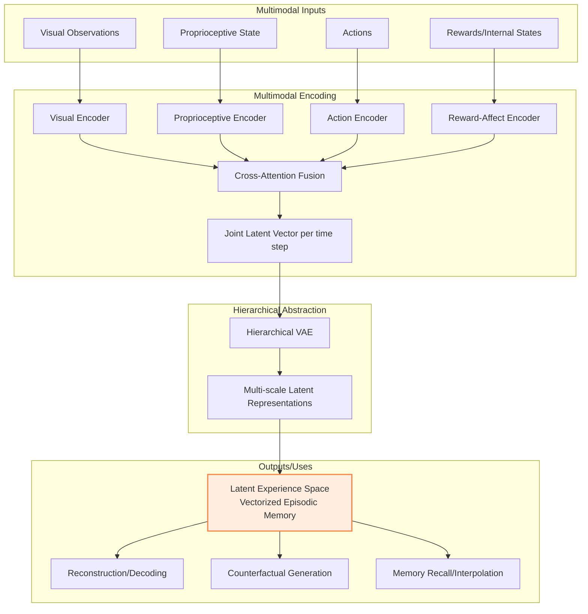

### Description:

This diagram shows the complete architecture and information flow of the Latent Experience Model:

**Input Layer**: Multimodal observations including visual data, proprioceptive state, actions, and rewards/internal states.

**Processing Pipeline**:

**Multimodal Encoding**: Individual encoders process each modality, then cross-attention fusion combines them into a joint latent vector per time step.

**Hierarchical Abstraction**: A three-tier Hierarchical VAE creates multi-scale representations from fine-grained details to abstract concepts.

**Output**: The final latent experience space serves as a "vectorized episodic memory" that supports reconstruction, counterfactual generation, and memory recall/interpolation.

The architecture enables agents to encode their experiences in a structured, manipulable form that supports introspection and counterfactual reasoning.
