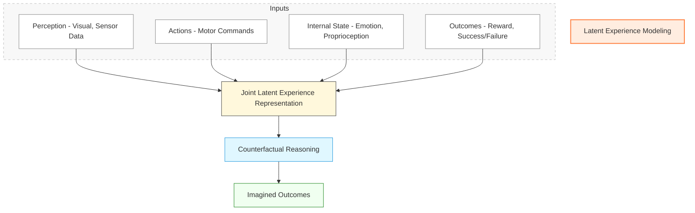

### Description:

* `A` is the main process block (highlighted).
* `Inputs` is a conceptual group for all input modalities.
* `L` is the **joint latent space** where all experience data fuses.
* `C` represents **Counterfactual Reasoning**, using the latent representation.
* `O2` represents **imagined outcomes**, i.e., the result of hypothetical reasoning.
