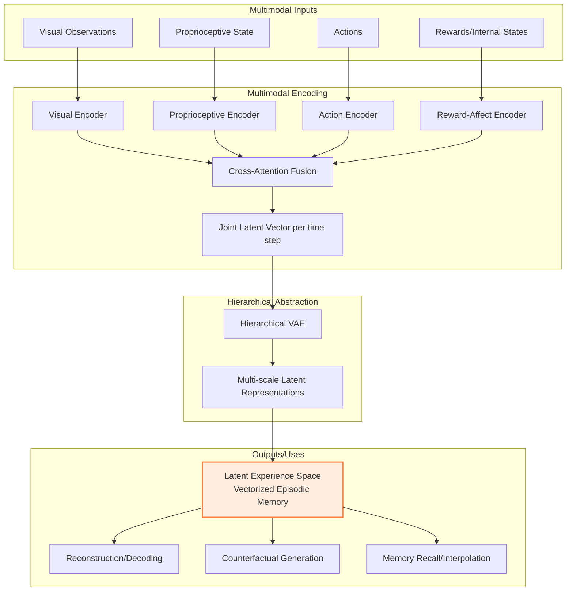

# Latent Experience Modeling

A research project focused on developing computational models of agent experience through structured latent representations of multimodal inputs.

## Overview

This project proposes a **Latent Experience Model** (LEM) that encodes an agent's multimodal experiences (perceptions, internal states, actions, outcomes) into structured, continuous representation spaces. These spaces support counterfactual reasoning and introspective capabilities, bridging reactive behavior and reflective cognition in artificial agents.

## Architecture

## Key Components

**Multimodal Encoding**: Individual encoders process each modality, then cross-attention fusion combines them into a joint latent vector per time step.

**Hierarchical Abstraction**: A three-tier Hierarchical VAE creates multi-scale representations from fine-grained details to abstract concepts.

**Output**: The final latent experience space serves as a "vectorized episodic memory" that supports reconstruction, counterfactual generation, and memory recall/interpolation.

## Research Goals

- Develop a computational substrate for memory and imagination grounded in latent space geometry
- Enable semantic recall of multimodal experiences
- Support smooth interpolation between past events
- Facilitate gradient-guided counterfactual simulation